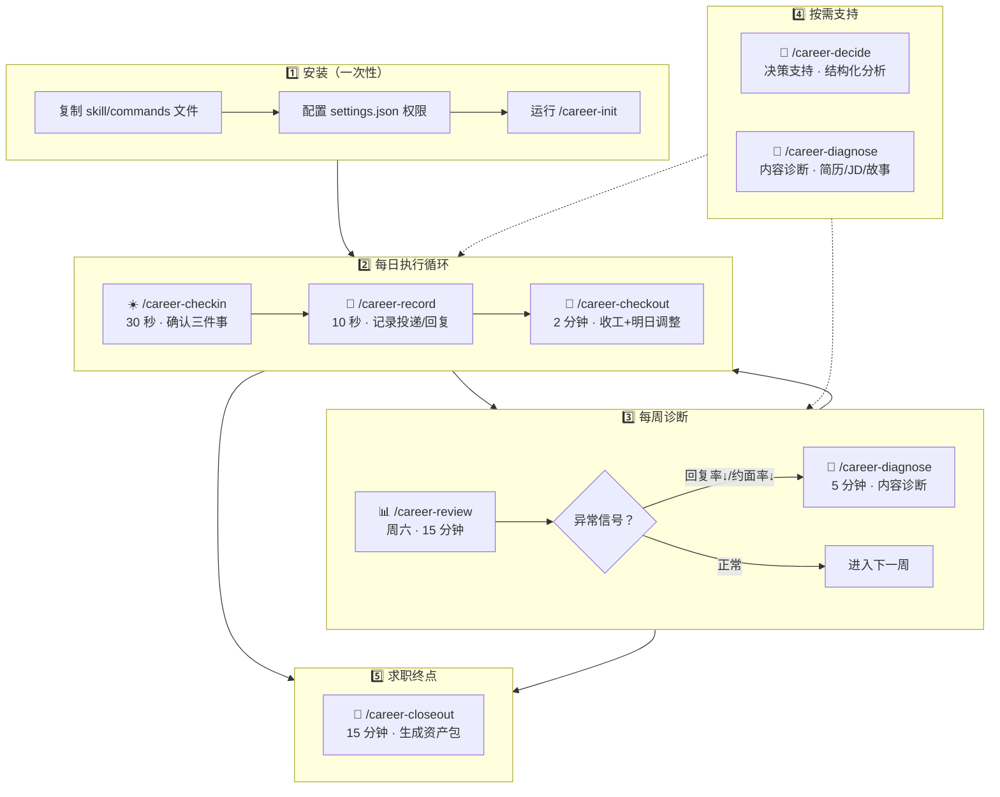
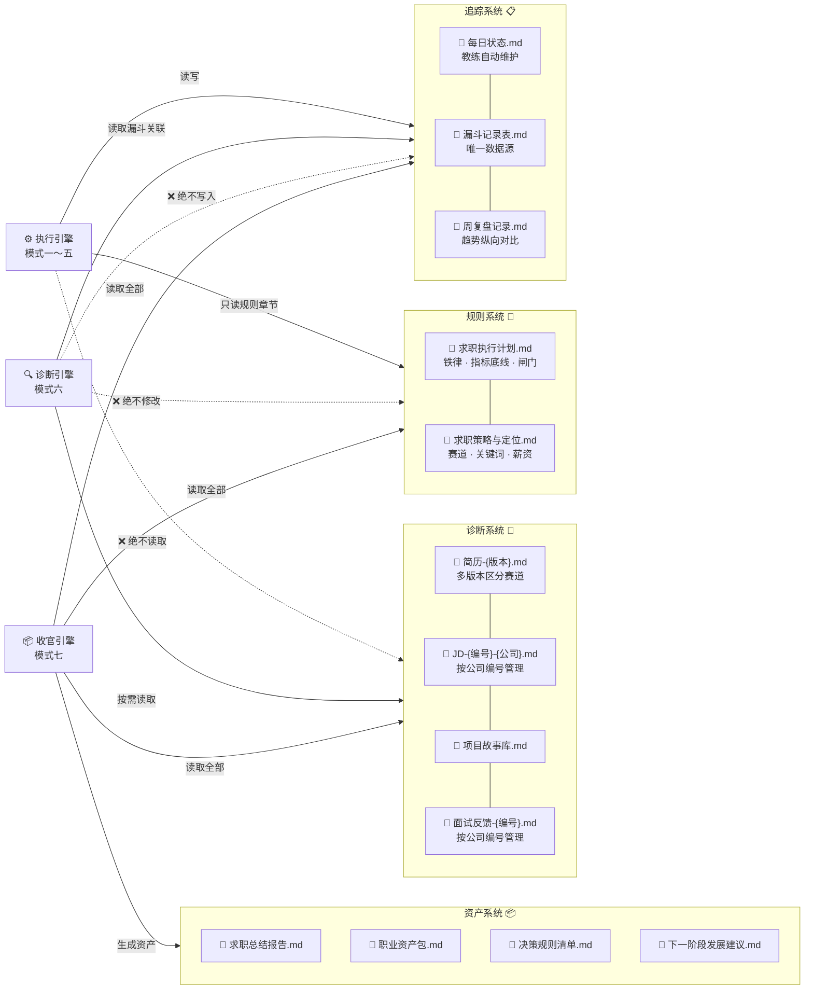
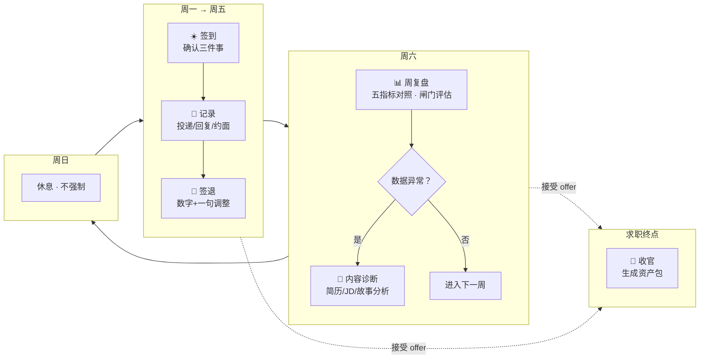

# Career Coach — Claude Code Skill

> 一个基于 Claude Code 的职业发展教练系统。帮你执行求职计划，而不是重新谈判。
> 求职结束后，将过程数据压缩为可复用的职业资产——不只是「我求过职」，而是「下次做职业决策不再需要重新摸索自己」。

## 这是什么？

**Career Coach** 是一个 Claude Code 自定义 skill，分为两层：

- **执行引擎**（日常）：每日签到、晚间复盘、漏斗记录、周六周复盘、决策支持
- **诊断引擎**（按需）：简历匹配、故事质量、JD 定位——仅在 `/career-diagnose` 中触发

求职结束后，`/career-closeout` 将本轮所有数据压缩为 4 份可复用资产。

核心理念：
- **调整只看每周六的漏斗数据，不看当天情绪**
- **预先承诺的规则只能执行，不能谈判**
- **降低执行摩擦比增强意志力更有效**

## 功能概览

| 命令 | 功能 | 耗时 | 频率 |
|------|------|------|------|
| `/career-init` | 初始化环境：创建目录、模板、计划文档 | 30 秒 | 一次 |
| `/career-checkin` | 晨间启动：确认今日三件事 + 漏斗进度 | 30 秒 | 每天 |
| `/career-checkout` | 晚间复盘：记录漏斗数字 + 明天调整一项 | 2 分钟 | 每天 |
| `/career-record` | 快速记录一次投递/回复/约面事件 | 10 秒 | 随时 |
| `/career-review` | 周六周复盘：五项指标对照 + 趋势 + 闸门评估 | 15 分钟 | 每周 |
| `/career-decide` | 结构化决策支持：不替你决定，帮你分析 | 按需 | 按需 |
| `/career-diagnose` | 内容诊断：简历匹配、故事质量、JD 定位 | 5–8 分钟 | 按需 |
| `/career-closeout` | 求职收官：生成可复用职业资产包 | 15–20 分钟 | 一次（终点） |

### 架构：两个引擎

Career Coach 将能力分为两层：

- **执行引擎**（模式一～五，默认）：盯执行状态与数字偏差，不判断内容质量
- **诊断引擎**（模式六，按需）：分析简历/JD/故事/面试反馈，不修改闸门规则

执行引擎发现漏斗异常时，会提示是否需要触发诊断——但不会自动诊断。两个引擎的上下文空间不共享。

- **5 道闸门**：现金预警、地域/薪资扩展、双轨再平衡、提前触发、中断警报等
- **6 种反模式**：情绪化改策略、简历注水、拒绝算法面、用规划替代行动、自责螺旋、同时做太多
- **执行/诊断隔离**：日常模式只读追踪数据，绝不自动加载简历；内容诊断只能在独立模式中触发

### 系统架构



### 三个子系统



| 子系统 | 管理方 | 文件位置 | 触发频率 | 读写规则 |
|--------|--------|----------|----------|----------|
| **追踪系统** | 教练自动维护 | `tracking/` | 每天 | 执行引擎读写；诊断引擎只读不写 |
| **规则系统** | 用户定义，教练执行 | `~/career-plan/` 根目录 | 初始化一次 | 执行引擎只读规则章节；诊断引擎不碰 |
| **诊断系统** | 用户按编号填充 | `profile/` | 按需（≤1 次/周） | 仅诊断引擎读取；执行引擎绝不读取 |
| **资产系统** | 教练在终点生成 | `archive/` | 仅一次 | 由模式七写入；执行引擎和诊断引擎不读取 |

### 文件编号约定

`profile/` 下的诊断文件建议使用编号管理，方便诊断引擎按目标公司/简历版本精确匹配：

```
profile/
├── 简历-主赛道.md              # 主攻方向简历
├── 简历-第二赛道.md            # 备用方向简历
├── 简历-通用版.md              # 保底简历
├── JD-01-字节.md               # 字节跳动某岗位
├── JD-02-腾讯.md               # 腾讯某岗位
├── JD-03-美团.md               # 美团某岗位
├── 项目故事库.md               # 所有五层故事汇总
├── 面试反馈-01.md              # 字节面试记录
├── 面试反馈-02.md              # 腾讯面试记录
└── 面试反馈-03.md              # 美团面试记录
```

诊断时教练可以精确匹配：`简历-主赛道.md` ↔ `JD-01-字节.md` ↔ `面试反馈-01.md`。

### 每周节奏



### 从过程到资产

这不是一个「陪你熬过一次求职」的工具。它的设计目标是：**求职结束后，你带走的不只是 offer，还有一套下次可直接复用的职业操作系统。**

```
原始追踪数据（tracking/）
    +
诊断分析数据（profile/）
    +
规则执行记录（周复盘 + 闸门触发）
    ↓
/career-closeout（模式七）
    ↓
┌─────────────────────────────────────┐
│ 📦 archive/                         │
│   ├── 求职总结报告.md                 │  ← 数字、转化、转折点、教训
│   ├── 职业资产包.md                   │  ← 简历、故事、自我介绍、面试题
│   ├── 决策规则清单.md                 │  ← 闸门、底线、offer 标准
│   ├── 下一阶段发展建议.md             │  ← 入职 30 天、转正 90 天、弱点
│   └── raw/                           │  ← 原始追踪数据完整存档
└─────────────────────────────────────┘
```

这 4 份资产的复用场景：
- **下次跳槽**：直接复用决策规则 + 职业资产包，不需要从零重建
- **晋升述职**：项目故事库和自我介绍模板直接可用
- **内部转岗**：简历版本策略和定位标签可迁移
- **薪资谈判**：历史报价和谈判记录作为基准线

## 安装

### 1. 复制文件

```bash
# Skill 定义
mkdir -p ~/.claude/skills/career-coach
cp skills/career-coach/SKILL.md ~/.claude/skills/career-coach/

# 命令文件
mkdir -p ~/.claude/commands
cp commands/career-*.md ~/.claude/commands/
```

### 2. 配置权限

将 `.claude/settings.example.json` 中的内容添加到你的 `~/.claude/settings.json`（或项目 `.claude/settings.json`）中，把 `YOUR_USERNAME` 替换为你的 macOS 用户名（终端运行 `whoami` 查看）。

### 3. 运行初始化

在 Claude Code 中运行：

```
/career-init
```

这个命令会自动：
- 创建 `~/career-plan/` 完整目录结构（tracking/、profile/、archive/）
- 写入三个追踪模板文件（每日状态、漏斗记录、周复盘）
- 生成可填写的最小化计划文档（`求职执行计划.md`、`求职策略与定位.md`）
- 输出你的个性化权限配置

初始化完成后，按模板中的 🔧 标记填入你的个人信息（5–10 分钟），然后就可以开始使用了。

## 使用示例

```bash
# 初始化
/career-init

# 早上开始
/career-checkin 1.投递20个目标岗位 2.写核心项目五层故事 3.约前同事内推

# 投了一个岗位，快速记录
/career-record Boss直聘 某科技公司 iOS开发工程师 已投递 主赛道版简历

# 收到回复了
/career-record Boss直聘 某科技公司 iOS开发工程师 已回复

# 晚上收工
/career-checkout 投递22 回复3 约面0

# 周六复盘
/career-review

# 做决定
/career-decide 要不要接受目前唯一的offer还是继续面

# 内容诊断
/career-diagnose 帮我对比简历和JD-01-字节的匹配度

# 求职结束，生成资产包
/career-closeout 接受了字节iOS 35K
```

## 自定义

### 周指标底线

初始化命令会生成 `求职执行计划.md`，在其中设定你的五个底线指标：

- 投递数 ≥ ? /周（建议起点：100）
- 回复数 ≥ ? /周（建议起点：25）
- 约面数 ≥ ? /周（建议起点：4）
- 二面数 ≥ ? /周（第 3 周起，建议起点：2）
- 五层故事累计 ≥ ?（第 2 周末，建议起点：8）

### 闸门触发条件

修改 `career-coach/SKILL.md` 中「闸门触发逻辑」部分的条件和动作，适配你的实际情况。

### 反模式

如果你有额外的行为模式需要教练检测，在「反模式检测」部分添加新的 AP。

## 文件结构

```
~/
├── .claude/
│   ├── skills/
│   │   └── career-coach/
│   │       └── SKILL.md          # 教练系统定义
│   └── commands/
│       ├── career-init.md        # 环境初始化
│       ├── career-checkin.md     # 晨间签到
│       ├── career-checkout.md    # 晚间复盘
│       ├── career-record.md      # 漏斗记录
│       ├── career-review.md      # 周复盘
│       ├── career-decide.md      # 决策支持
│       ├── career-diagnose.md    # 内容诊断
│       └── career-closeout.md    # 求职收官
└── career-plan/                  # 你的计划文档（初始化自动生成）
    ├── 求职执行计划.md            # 规则、指标、阶段
    ├── 求职策略与定位.md          # 赛道、薪资、关键词
    ├── tracking/                 # 教练自动维护
    │   ├── 每日状态.md
    │   ├── 漏斗记录表.md
    │   └── 周复盘记录.md
    ├── profile/                  # 你手动填充（按需诊断数据）
    │   ├── 简历-{版本}.md        # 多版本简历，按赛道区分
    │   ├── JD-{编号}-{公司}.md   # 目标岗位 JD，按公司编号
    │   ├── 项目故事库.md
    │   └── 面试反馈-{编号}.md    # 面试记录，按公司编号
    └── archive/                  # 求职终点生成（可复用资产）
        ├── 求职总结报告.md
        ├── 职业资产包.md
        ├── 决策规则清单.md
        ├── 下一阶段发展建议.md
        └── raw/                  # 原始追踪数据存档
```

## 原理

Career Coach 利用了 Claude Code 的 skill 系统：SKILL.md 定义了一个完整的 agent 人物设定、工作流、规则引擎。slash command 是进入特定模式的快捷方式。

教练**不存储你的数据**——它通过读写 `~/career-plan/` 下的 markdown 文件来追踪状态。你的数据完全在本地。

## 平台兼容性

| 平台 | 兼容性 | 说明 |
|------|--------|------|
| Claude Code CLI | 原生支持 | 本 skill 为 Claude Code 设计，所有功能正常工作 |
| Claude Desktop | 不兼容 | 桌面应用的 skill 打包格式和文件访问模型不同 |
| Cursor IDE | 不兼容 | Cursor 使用 `.cursor/rules/` `.mdc` 格式，与本 skill 的 SKILL.md + commands 打包方式不同 |

如果你需要在其他平台使用类似功能，可以将 SKILL.md 的核心规则和文档结构移植到对应平台的约定中，但本仓库的安装方式仅适用于 Claude Code CLI。

## 语言

当前版本为中文。欢迎贡献英文翻译。

## 协议

MIT — 自由使用、修改、分发。
